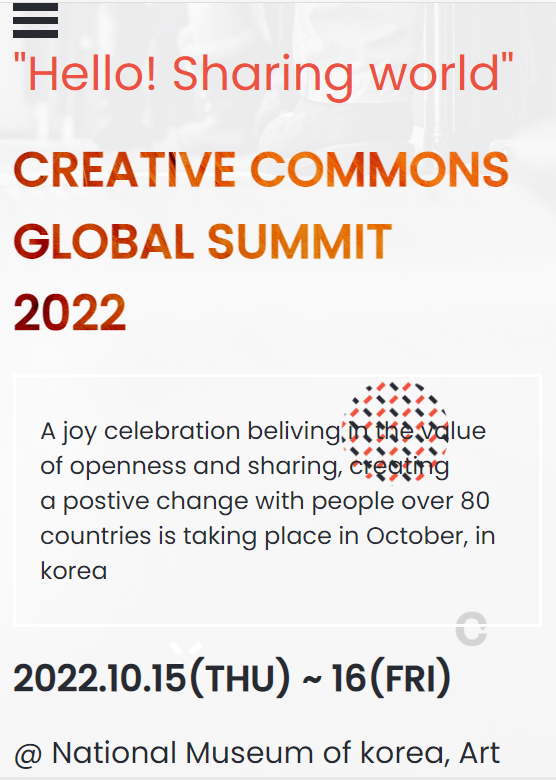
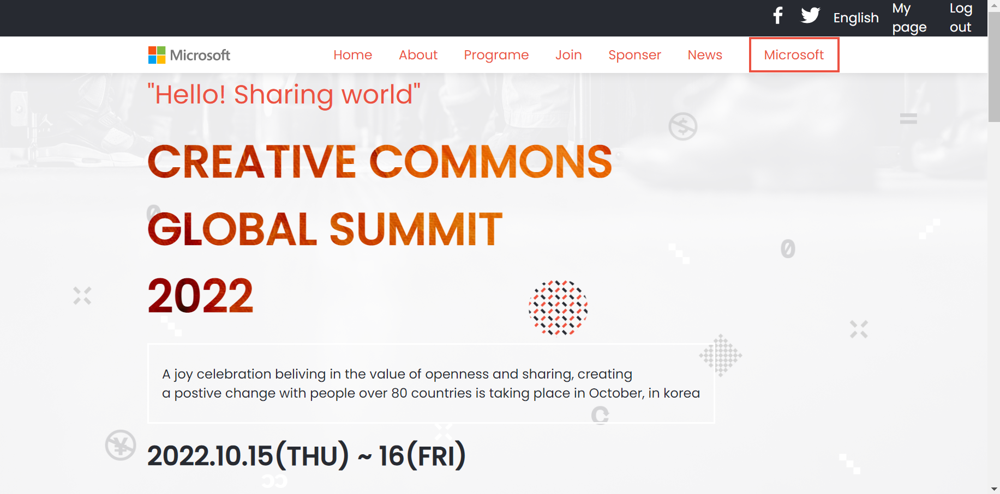

# Capstone-project


<div align="center">
  <!-- You are encouraged to replace this logo with your own! Otherwise you can also remove it. -->


</div>

<!-- TABLE OF CONTENTS -->

# 📗 Table of Contents

- [📖 About the Project](#about-project)
  - [🛠 Built With](#built-with)
    - [Tech Stack](#tech-stack)
    - [Key Features](#key-features)
  - [🚀 Live Demo](#live-demo)
- [💻 Getting Started](#getting-started)
  - [Setup](#setup)
  - [Prerequisites](#prerequisites)
  - [Install](#install)
  - [Usage](#usage)
  - [Run tests](#run-tests)
  - [Deployment](#triangular_flag_on_post-deployment)
- [👥 Authors](#authors)
- [🔭 Future Features](#future-features)
- [🤝 Contributing](#contributing)
- [⭐️ Show your support](#support)
- [🙏 Acknowledgements](#acknowledgements)
- [❓ FAQ (OPTIONAL)](#faq)
- [📝 License](#license)

<!-- PROJECT DESCRIPTION -->

# 📖 [My Capstone Project] <a name="about-project"></a>

 This project is to put to test the understanding of individual student on what they've studied so far from the curriculum's module 1.!
 - Here is the page preview

> |     | Mobile version                                  | Desktop version                                  |     |
> | --- | ----------------------------------------------- | ------------------------------------------------ | --- |
> |     |  |  |


> Learning objectives

- I Used semantic HTML tags.
- I Applied best practices in HTML code.
- Used CSS selectors correctly.
- Used CSS box model.
- Used Flexbox to place elements on the page.
- Demonstrated ability to create UIs adaptable to different screen sizes using media queries.
- Used GitHub Pages to deploy web pages.
- Applied JavaScript best practices and language style guides in code.
- Used JavaScript to manipulate DOM elements.
- Used JavaScript events.
- Used objects to store and access data.
- Communicated technical concepts to other technical people.

 

## 🛠 Built With <a name="built-with"></a>

### Tech Stack <a name="tech-stack"></a>


<details>
  <summary>HTML</summary>
  <ul>
    <li><a href="https://developer.mozilla.org/en-US/docs/Web/HTML">Html</a></li>
  </ul>
</details>

<details>
  <summary>CSS</summary>
  <ul>
    <li><a href="https://developer.mozilla.org/en-US/docs/Web/CSS">CSS</a></li>
  </ul>
</details>

<details>
<summary>Git&Github</summary>
  <ul>
    <li><a href="https://docs.github.com/en/get-started/using-git/about-git">Git&Github</a></li>
  </ul>
</details>

<details>
<summary>Javascript</summary>
  <ul>
    <li><a href="https://developer.mozilla.org/en-US/docs/Web/JavaScript">JavaScript</a></li>
  </ul>
</details>

## Additional Tools

- WebHint
- Stylelint
- ESlint
- Node Packet Manager

<!-- Features -->


### Key Features <a name="key-features"></a>


- [Create the toolbar]
- [Create the headline section]
- [Import svg images and style accordingly]
- [Enhancing CSS classes ]
- [Use css minifier to get on css file ]
- [buttons]
- [Contact Form]
- [Navigation Section]
- [Portfolio Page]
- [Headline Section]
- [About page]


<p align="right">(<a href="#readme-top">back to top</a>)</p>

<!-- LIVE DEMO -->

## 🚀 Live Demo <a name="live-demo"></a>
https://aj193.github.io/Capstone-project/index.html

## 🚀 Loom Link <a name="Loom-Link"></a>
https://www.loom.com/share/84413da408af4a7c81803071a289cd0e


<p align="right">(<a href="#readme-top">back to top</a>)</p>


<!-- GETTING STARTED -->

## 💻 Getting Started <a name="getting-started"></a>

To get a local copy up and running, follow these steps.

### Prerequisites

- Basic html, css and medium Javascript know how.
- Git installation
- A text editor
- A terminal
- A web browser to view output e.g Google Chrome
- An IDE e.g Visual studio code

In order to run this project you need:

`npm install`

### Setup

Clone this repository to your desired folder:


```cd my-folder```


```git clone git@github.com:tamoorsaeed22/My-Capstone-Project.git```


### Install

Install this project with:

`cd my-project`


`npm install`

=======

```cd my-folder```


```git clone git@github.com:tamoorsaeed22/My-Capstone-Project.git```


### Install

Install this project with:

`cd my-project`


`npm install`


### Usage

To run the project, execute the following command:

`live server`

`npm start`

### Run tests

To run tests, run the following command:

`npm install --save-dev hint@7.x`

`npx stylelint "**/*.{css,scss}"`

### Deployment

You can deploy this project using:

`github pages`


<p align="right">(<a href="#readme-top">back to top</a>)</p>

<!-- AUTHORS -->

## 👥 Authors <a name="authors"></a>


👤 **Ghulam Shabbir**

- GitHub: [@githubhandle](https://github.com/AJ193)
- Twitter: [@twitterhandle](https://twitter.com/GhulamShabbir59)
- LinkedIn: [LinkedIn](https://www.linkedin.com/in/ghulam-shabbir-225264247/)


<p align="right">(<a href="#readme-top">back to top</a>)</p>

<!-- FUTURE FEATURES -->

## 🔭 Future Features <a name="future-features"></a>


- [ ] **[Add More styling]**
- [ ] **[HTML pop up]**
- [ ] **[Add work and about section]**
- [ ] **[Local Host]**
- [ ] **[Web browser access]**


<p align="right">(<a href="#readme-top">back to top</a>)</p>

<!-- CONTRIBUTING -->

## 🤝 Contributing <a name="contributing"></a>

Contributions, issues, and feature requests are welcome!

Feel free to check the [issues page](../../issues/).

<p align="right">(<a href="#readme-top">back to top</a>)</p>

<!-- SUPPORT -->

## ⭐️ Show your support <a name="support"></a>


Most of us are pretty good at judging whether a project is relevant for us. We might not be the master of it but we might recognize that we’ve done something similar before and feel confident that we can pick it up and help.If you can’t find anything you think you are good at, consider looking at different projects that require less technical skill.If relevant for the project, you can also prepare some samples specific to the project to impress the client.The trick is to prepare some that are slightly different or watermarked, so they can’t use them in the project but close enough that they can see the potential If you like this project, kindly give it a star.

<p align="right">(<a href="#readme-top">back to top</a>)</p>

<!-- ACKNOWLEDGEMENTS -->

## 🙏 Acknowledgments <a name="acknowledgements"></a>

- The original design ideal by [Cindy Shin in Behance](https://www.behance.net/adagio07)
- Project from [Microverse](https://bit.ly/MicroverseTN) html & css module
- Images inspired by [Unsplash](https://unsplash.com)
- Topic inspired by [Khadija Hamdani](https://www.researchgate.net/publication/329972741_Knowledge_based_entrepreneurship_the_role_of_networks)

I would like to thank my colleague and Microverse for the opportunity

<p align="right">(<a href="#readme-top">back to top</a>)</p>


<!-- LICENSE -->

## 📝 License <a name="license"></a>


This project is [MIT](./LICENSE) licensed.

